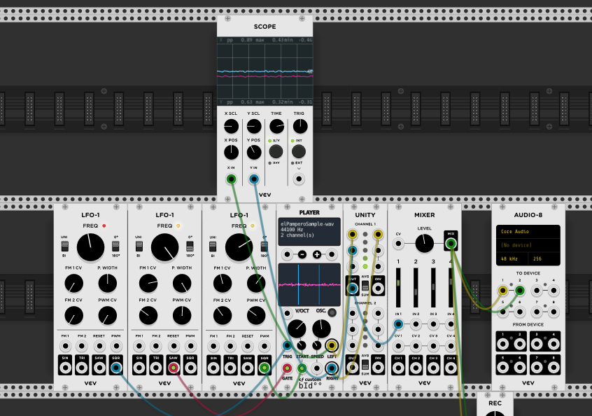
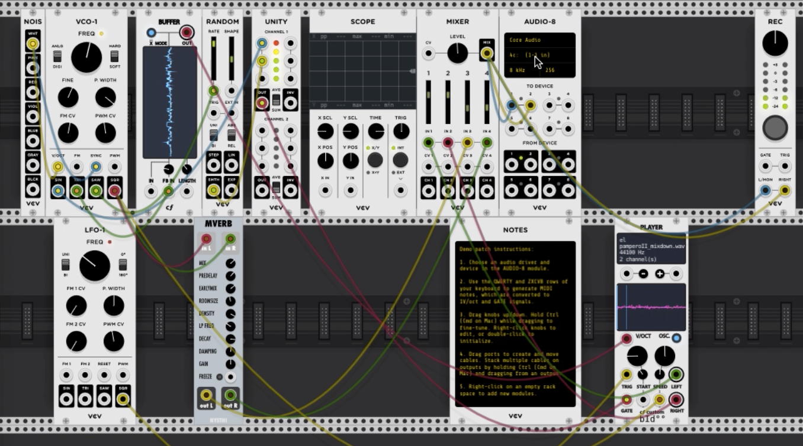
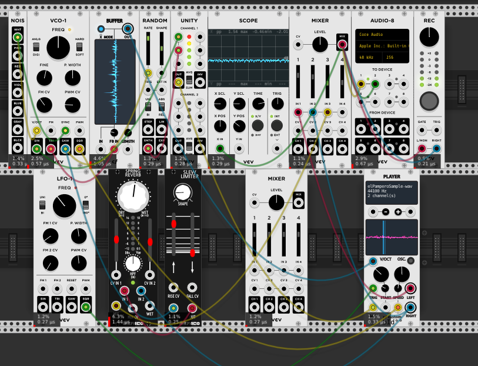

## Original Score

> 

> 

> <br></br>

> Play around, and make some noise.  
> 
> **Have fun! :)**
> 

## Reflections

### Listening the the recording

I get so many details listening to it with the headphones.

There are many layers that add up with time.  
The drawing is a good representation of what is happening with the sound. 

When playing the recording, I put it in loop and it creates a, infinite sound. Beginning and end merge together.

The first 2 seconds, I see the sea and a sea-wave starting to get shape, the sea-wave transforms in the highway because I can hear cars and trucks honking. 
What it seems as white noise starts playing and exponentially taking presence. 
Different sounds are coming behind the white noise.  

From 00:14-00:16 High pitch sounds, something going super fast, appearing and dissapearing. I can hear a violin playing these high pitches.

**Layers playing together:** 

* Violin
* Honks
* Noise
* Highway

00:18- 00:22 Slow fade out to spacey, video-game like sounds. 
 
00:22 spacey, video-game like sounds with a little bit of noise that becomes more present at 00:32  

00:34 spacey sounds shut down, I can hear noise, is it rain? or a power plant breaking down?
  
   The sound of the highway is always in the background. 
    
   The spacey video game sounds come back, with the white noise.  
   
   Is it a TV? Trying to get signal with a rabbit antenna? And there is wind blowing.
    
**Is that wind the Pampero coming from the south? Is the Pampero meeting the Gardiner?** 
  

```
	'Yes, I know;' and turning to his companions, added,  
    'see, a change of weather is coming! We are going to have  
    a taste of PAMPERO.' And he went on to explain that this 
    PAMPERO is very common in the Argentine plains. It is an 
    extremely dry wind which blows from the southwest.[...]  
    The PAMPERO generally brings a tempest which lasts three days,  
    and may be always foretold by the depression of the mercury,'  
    he said. 'But when the barometer rises, on the contrary,  
    which is the case now, all we need expect is a few violent 
    blasts. So you can make your mind easy, my good friend;  
    by sunrise the sky will be quite clear again.'

Jules Verne, 1868: In Search of the Castaways.  
CHAPTER XVI: THE NEWS OF THE LOST CAPTAIN. 
```
> >[Source Quote][sourceIDquote]

[sourceIDquote]: https://www.weatheronline.co.uk/reports/wind/The-Pampero.htm "Pampero"

I also remember the song "El Pampero" by Julieta Laso, and there is section with violin and guitar. I decide to sample the song. 

**Source- El Pampero, Julieta Laso**
[Source Song][sourceIDsong]

[sourceIDsong]: https://www.youtube.com/watch?v=Tqror89YYXs" 

### Performing the score	

Before opening patch.vcv, add those modules to Rack 

* Amalgamated Harmonics
	* 	Galaxy
	*  Arpeggiator2
* Audible Instruments
	* Branches
	* Clouds


 
### Experimenting with score and modules

> #### Notes
> > Playing around and got some noise and blips that could be used

> 


> Try to find a sampler and sample Julieta Laso "El Pampero"  
> 

>>> May be the violin from the song?
(add a clip of the violins, the one to be sampled) 

Steps:

* Found a player: https://github.com/cfoulc/cf
* https://vcvrack.com/plugins, look for cf and add 
* Update library in VCV Rack
* Cut a section of the song with Audition and export it as .wav 
* Save the .wav file in the extensions folder
* Add player module to the rack 
* right click on player and load sample and choose the saved file

  

Listen to how it sounds: [Sample Violin][sampleVCVfile]

[sampleVCVfile]: extensions/experimentingSampleViolin.vcv 

* In order for it to work, you have to have the module cf already installed in VCV Rack and elPamperoSample.wav in extensions

### Adding the sampler to the original score

After finding the sampler and trying to reproduce the score I was given, I decided to add the sampler in that score. To see if I could produce a interesting sound with all those layers of sound and the sample 

I wish I could have reproduced the waves and highways sounds from the original but after many attempts, couldn't make it work. 

Before adding and delting modules I am trying adding the sampler in the module, There is an effect that I like to see how to control 


When the violins merge with the theremin


* The saw from th LFO-1 controls the speed that the sample play
* The triangular controls de starting point

#### Issues recording the patch

When I put to record the patch, it only records one layer of sound, that is the sampler. 


After many attempts to record all the modules combined, I am going to start the module from scratch to see if it works or what I get


While experimenting and adding modules, there is a rythm that I like, I recorded it and I might use it as a sample
It still reminds me of a distorted Hitchcock film. 



It needs noise and some of the things form the other patch that I like.

## Final Score



```
"Asks when fear is going, 
asks when fear is going,
asks when fear is going, 
Asks when fear is going to diguise"
El Pampero, Julieta Laso
```

For this patch:

* Add cf plugin https://vcvrack.com/plugins, look for cf and add Player module
* Add the module Mverb
* In Player, right click and load the file elPamperoSample.wav, it is in extensions/elPamperoSample.wav


```
*** Important note ***
the mverb module crash on my comuter. I changed it for:
* Spring reverb 
* Slew limiter
```



---
------

## Reflection of Last Patch_week02


------

**Analysis of Sound Segmentation**


>***Sound Info***

>>* Duration: 1:53.870
>>* Sample Rate: 44100 Hz
>>* Channels: Stereo
>>* Bit Depth: 16-bit
>>* Format: Waveform Audio 16-bit Integer 
>>
>>This patch consists of one basic tone principle and one sampled song. The whole spectrum of the sound employs the mixing manner of repeating the clip of the sampled song, distorting and twisting the tone principle, and altering different parts of the music wandering between D# to F#. The extreme contrast between D# and F# tone presents and weaves an unusual musical texture to the sampled song. 

---

>***Comment_RacelarHo***

>>* The homophony here consists of the dialling-signal-like sounds, and it reminds me of the Electronic Music of the 1960s, especially the concept of Cybernetics.
>>* Compared with the general Experimental Music, this work avoids the regular forms, such as forma sonata, variation form and rondo form, but employs ritornello form with more stretchable amplitudes and intensities. Reference: the 59 - 69 syllable (the epilogue of Episode 6) of Bach's Violin Concerto in E Major. 

---
>***Inspiration_week02_RacelarHo***

>>* I'm going to inherit the tone principle here as the Music Bed of the new sound and continue the ritornello form, especially Bach's work I mentioned upon.
>>* In the next version, I will supply additional tones, such as female voice, to abundant in the musical texture, and also reduce the volumes of the overfrequency pitches.   
 
---

**Initial Sound Segmentations_Week02**

Time  | Description  | Sound Info
------------- | ------------- | -------------
0:00.000 ~ 0:20.000 | tone principle 01 | low-frequency tone with a mixing tone of white noises and the clip of "El Pampero" by Julieta Laso.
0:20.000 ~ 0:22.000 | transient period | low-frequency tone with loudly white noise.
0:22.000 ~ 0:26.000 | tone principle 01 | low-frequency tone with a mixing tone of white noises and the clip of "El Pampero" by Julieta Laso.
0:26.100 ~ 0:28.00 | transient period | low-frequency tone with loudly white noise.
0:28.000 ~ 0:31.500 | tone principle 02 | The singer's vocal starts mixed with loudly white noise.
0:31.000 ~ 0:35.000 | the clip of sampled song(repeat_01) | The clip of a sampled song with lossless sound starts playing. 
0:35.000 ~ 0:37.000 | the clip of sampled song(repeat_02) | The clip of a sampled song with lossless sound starts playing. 
0:37.000 ~ 0:40.000 | the clip of sampled song(repeat_03) | The clip of a sampled song with lossless sound starts playing. 
0:40:000 ~ 0:43.000 | the clip of sampled song(repeat_04) | The clip of a sampled song with lossless sound starts playing. 
0:43.000 ~ 0:45.328 | the clip of sampled song(repeat_05) | The clip of a sampled song with lossless sound starts playing. 
0:45.328 ~ 1:09.00 | tone principle 03 x 3 | low-frequency tone with a mixing tone of super loudly white noises and the clip of "El Pampero" by Julieta Laso.
1:09.00 ~ 1:41.899 | tone principle 04 | low-frequency and twisting tone with super loudly white noises and the clip of "El Pampero" by Julieta Laso from C# drops to D#.
1:41.899 ~ 1:46.450 | transient period  | D# tone, the background music of the song is nearly unhearable.
1:46.450 ~ 1:53.870 | tone principle 05  |F#B tone with extreme distorting detonation and pitches.


 


  


 


