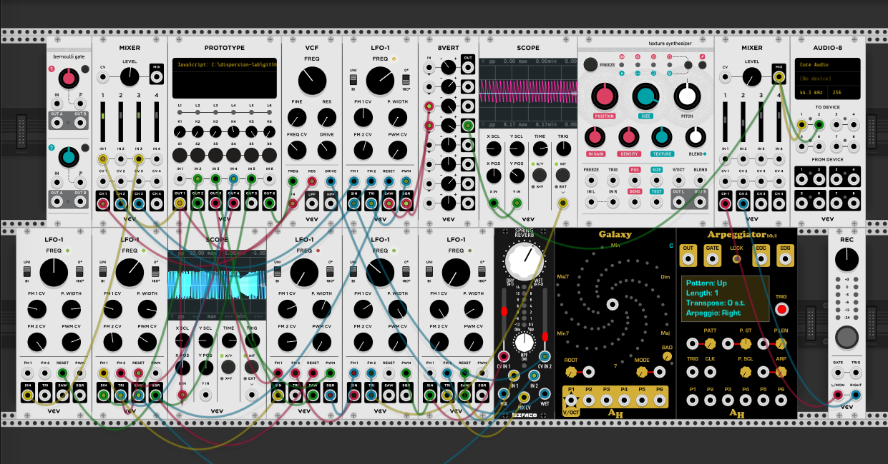
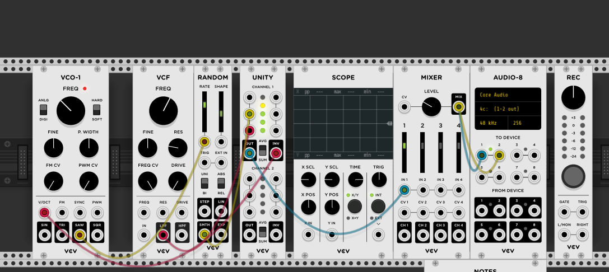
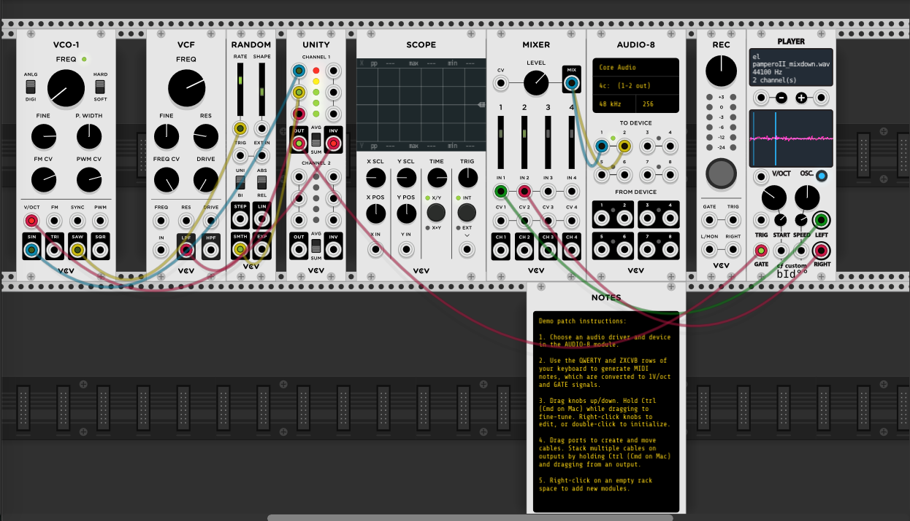
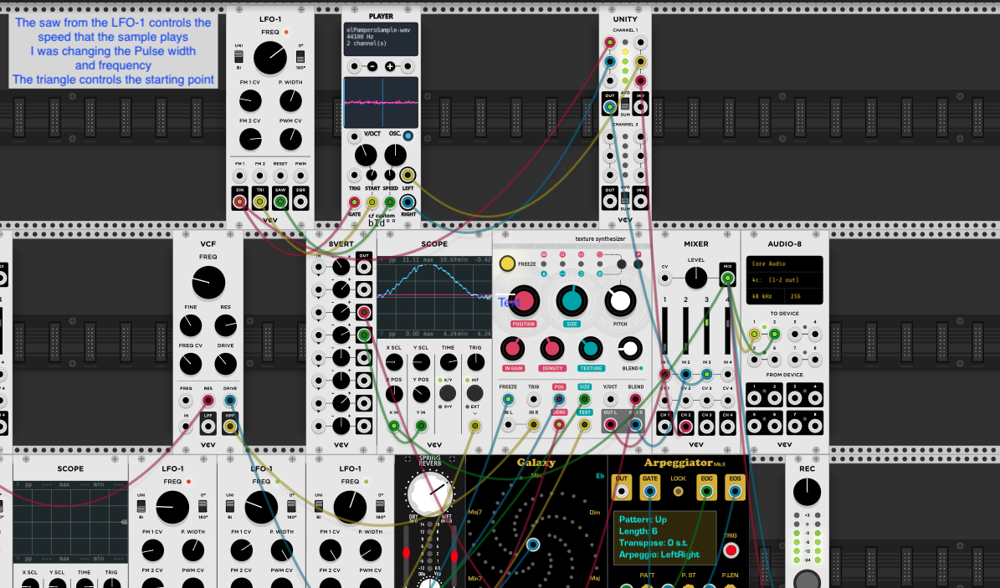
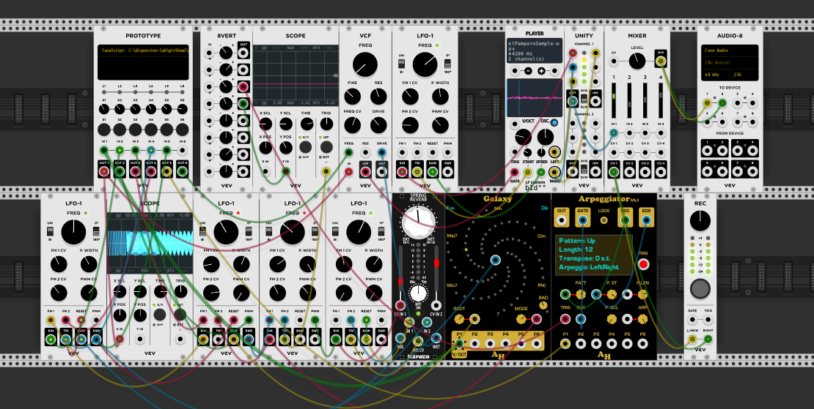

## Original Score

> 

> 

> <br></br>

> Play around, and make some noise.  
> 
> **Have fun! :)**
> 

## Reflections

### Listening the the recording

I get so many details listening to it with the headphones.

There are many layers that add up with time.  
The drawing is a good representation of what is happening with the sound. 

When playing the recording, I put it in loop and it creates a, infinite sound. Beginning and end merge together.

The first 2 seconds, I see the sea and a sea-wave starting to get shape, the sea-wave transforms in the highway because I can hear cars and trucks honking. 
What it seems as white noise starts playing and exponentially taking presence. 
Different sounds are coming behind the white noise.  

From 00:14-00:16 High pitch sounds, something going super fast, appearing and dissapearing. I can hear a violin playing these high pitches.

**Layers playing together:** 

* Violin
* Honks
* Noise
* Highway

00:18- 00:22 Slow fade out to spacey, video-game like sounds. 
 
00:22 spacey, video-game like sounds with a little bit of noise that becomes more present at 00:32  

00:34 spacey sounds shut down, I can hear noise, is it rain? or a power plant breaking down?
  
   The sound of the highway is always in the background. 
    
   The spacey video game sounds come back, with the white noise.  
   
   Is it a TV? Trying to get signal with a rabbit antenna? And there is wind blowing.
    
**Is that wind the Pampero coming from the south? Is the Pampero meeting the Gardiner?** 
  

```
	'Yes, I know;' and turning to his companions, added,  
    'see, a change of weather is coming! We are going to have  
    a taste of PAMPERO.' And he went on to explain that this 
    PAMPERO is very common in the Argentine plains. It is an 
    extremely dry wind which blows from the southwest.[...]  
    The PAMPERO generally brings a tempest which lasts three days,  
    and may be always foretold by the depression of the mercury,'  
    he said. 'But when the barometer rises, on the contrary,  
    which is the case now, all we need expect is a few violent 
    blasts. So you can make your mind easy, my good friend;  
    by sunrise the sky will be quite clear again.'

Jules Verne, 1868: In Search of the Castaways.  
CHAPTER XVI: THE NEWS OF THE LOST CAPTAIN. 
```
> >[Source Quote][sourceIDquote]

[sourceIDquote]: https://www.weatheronline.co.uk/reports/wind/The-Pampero.htm "Pampero"

I also remember the song "El Pampero" by Julieta Laso, and there is section with violin and guitar. I decide to sample the song. 

**Source- El Pampero, Julieta Laso**
[Source Song][sourceIDsong]

[sourceIDsong]: https://www.youtube.com/watch?v=Tqror89YYXs" 

### Performing the score	

When I open the patch to perform,I realized I need to get some modules for the score to fully work:

* Amalgamated Harmonics
	* 	Galaxy
	*  Arpeggiator2
* Audible Instruments
	* Branches
	* Clouds


 
Before opening patch.vcv, add those modules to Rack so connections are not lost


### Experimenting with score and modules

> #### Notes
> > Playing around and got some noise and blips that could be used

> 


> Try to find a sampler and sample Julieta Laso "El Pampero"  
> 

>>> May be the violin from the song?
(add a clip of the violins, the one to be sampled) 

Steps:

* Found a player: https://github.com/cfoulc/cf
* https://vcvrack.com/plugins, look for cf and add 
* Update library in VCV Rack
* Cut a section of the song with Audition and export it as .wav 
* Save the .wav file in the extensions folder
* Add player module to the rack 
* right click on player and load sample and choose the saved file

  

Listen to how it sounds: [Sample Violin][sampleVCVfile]

[sampleVCVfile]: extensions/experimentingSampleViolin.vcv 

* In order for it to work, you have to have the module cf already installed in VCV Rack and elPamperoSample.wav in extensions

### Adding the sampler to the original score

After finding the sampler and trying to reproduce the score I was given, I decided to add the sampler in that score. To see if I could produce a interesting sound with all those layers of sound and the sample 

I wish I could have reproduced the waves and highways sounds from the original but after many attempts, couldn't make it work. 

Before adding and delting modules I am trying adding the sampler in the module, There is an effect that I like to see how to control 


When the violins merge with the theremin



* The saw from th LFO-1 controls the speed that the sample play
* The triangular controls de starting point

#### Issues recording the patch

When I put to record the patch, it only records one layer of sound, that is the sampler. 




 


  


 


